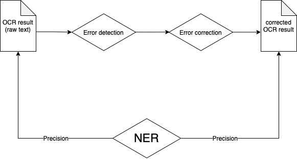

# Correction des sorties OCR/HTR
<!--The present research was conducted during my internship within the project-team SCAI | ObTIC (Sorbonne Center for Artificial Intelligence | Observatoire des Textes, des Idées et des Corpus), under the supervision of Motasem Alrahabi.-->

<!-- This repository contains code developed for spell checking the raw OCRised French texts in the TEI-XML format issued from the [Très Grande Bibliothèque](http://obvil.lip6.fr/tgb/) (TGB).-->

Ce dépôt contient du code python pour la correction automatique des sorties OCR.

Les formats des fichiers d'entrée supportés :

* XML
* `.txt`

Les fichiers-exemples utilisés :

* _Traité des maladies nerveuses, hypocondriaques et hystériques,_ par Robert Whytt ([lien](https://patrimoine.sorbonne-universite.fr/fonds/item/716-traite-des-maladies-nerveuses-hypocondriaques-et-hysteriques?offset=1)) ;
* _*Registre du Comité d'administration du Théâtre français de S. M. l'Empereur et Roi*_, par Nicolas Bernard (fichiers fournis par Blandine Bourdy, au sein du programme « [site web](https://www.cfregisters.org/#!/equipe)) ;
* _Mémoires secrets pour servir à l'histoire de la république des lettres  en France depuis 1762 jusqu'à nos jours, ou Journal d'un observateur_, par Louis Petit de Bachaumont ([lien](http://catalogue.bnf.fr/ark:/12148/cb300445027)).

<!--Three spellchecking libraries have been tested: [`pyspellchecker`](https://github.com/barrust/pyspellchecker), [`pyenchant`](https://github.com/pyenchant/pyenchant) and [`jamspell`](https://github.com/bakwc/JamSpell), with the aim to compare the two approaches in terms of their general performance:-->

Trois librairies ont été testées :

1. `pyspellchecker` and `pyenchant` (approche par **dictionnaire**) ;
2. `jamspell` (approche par **apprentissage machine**).

<!--The ultimate goal was not the correction post-OCR _per se_, but the valorisation and the exploitation of the orthographically corrected corpus via the named entity recognition (NER) method, in order to determine the impact of the spellchecking libraries on the NER task.-->

<!--The code for spellchecking the texts with `pyenchant` was originally written by Nicolas Hiebel, the former intern of the former OBVIL Laboratory of Excellence (cf. the original [repo](https://github.com/Hiebel/Stage-OBVIL-2020/tree/master/Python)).-->

Le code de correction orthographique des textes avec `pyenchant` a été écrit par Nicolas Hiebel, l'ancien stagiaire de l'ancien laboratoire d'excellence OBVIL (cf. le [repo](https://github.com/Hiebel/Stage-OBVIL-2020/arbre/maître/Python) original).

# <!--Workflow-->
<!--The flowchart diagram below illustrates the general idea of the project:-->

<!---->

# Résultats
<!--The use of those three libraries has relatively improved the text output, even though some results are not perfect:-->

L'utilisation de ces trois librairies a relativement amélioré la sortie texte.

Pour de meilleurs résultats, a priori il faut implémenter / _fine-tuner_ le correcteur d'orthographe basé sur l'architecture BERT, comme `neuspell`, `spell4french`, `spacy-transformers`  (s'appuyant sur le modèle `CamemBERT` etc.).

## `pyspellchecker`
<!--Some tokens have been well corrected, especially those containing the recurrent alternation throughout the text of the type **_ſ:s_**, where the _ſ_ is a ligature designating the "long s" (e.g. _con_**_ſ_**_eillers > con_**_s_**_eillers, repré_**_ſ_**_ente > repré_**_s_**_ente, diver_**_ſ_**_es > diver_**_s_**_es_ and so on).-->

Les tokens contenant les ligatures (*long s* : _ſ_) ont été corrigés : ex. _con_**_ſ_**_eillers > con_**_s_**_eillers (mais pas p. ex. les entités moins connues : _Tchun-t_**_ſ_**_iou__).

<!--However, the library sometimes corrects words that do not require correction (**_l_**_’abondance > abondance_).-->

Dans la même veine, les formes archaïques des verbes ont été modernisées : _apport_**_o_**_it > apport_**_a_**_it_.

<!--The archaic forms of verbs were modernised during the correction (_apport_**_o_**_it > apport_**_a_**_it_).-->
<!--In addition, the less known named entities were not corrected, e.g. _Tchun-t_**_ſ_**_iou_ (a book about the description of China), instead of _Tchun-t_**_s_**_iou_.-->

<!--Correction examples:-->

Exemples des corrections :

|    Erreur    |  Correction  | Fréquence |
| :----------: | :----------: | :-------: |
|  dirfufion   |  diffusion   |     1     |
|  fubtilité   |  subtilité   |     1     |
|  confufion   |  confusion   |     1     |
|   doftrine   |   doctrine   |     1     |
|   doéleurs   |   douleurs   |     1     |
|    falle     |    fille     |     1     |
|   s’étoit    |    sétait    |     1     |
|  doctrinede  |   doctrine   |     1     |
|    fophe     |    force     |     1     |
| expreflions  | expressions  |     1     |
| cnfcignement | cnfcignement |     1     |
|  illupcres   |  illustres   |     1     |

## `pyenchant`
<!--This library corrected some words that `pyspellchecker` did not correct.-->

Cette librairie corrige certains mots que `pyspellchecker` n'a pas corrigé.

<!--Correction examples:-->

Exemples :

|      Erreur       |        Correction         |                           Contexte                           | Nom du fichier |
| :---------------: | :-----------------------: | :----------------------------------------------------------: | -------------- |
|     occafion      |         occasion          | que où osâtes les informerons sont rapportées à l’occafion des événements observations va il falloir donc da | 5419000.txt    |
| moralepolitiquede | Pas de correction trouvée | pplication pour bien entendre les principes de la moralepolitiquede la chine et pour peu qu’il y eût d’interruption o | 5419000.txt    |
|        qu         |            que            | ipes de la moralepolitiquede la chine et pour peu que’il y eût d’interruption ou de relâchement dans l | 5419000.txt    |
|     néceflîté     |         nécessité         | endus et l’on devoir moins sentir et connaître la néceflîté de suivre la doctrine qu’ils renferment c’efl ce | 5419000.txt    |
|        efl        |            et             | essité de suivre la doctrine que’ils renferment c’eflce qui arriva lorsque le trône fut occupé par des | 5419000.txt    |
|   introduifent    |       introduisent        | nt de ce moment de négligence et de relâchement s’introduifent à la cour et de la cour fe communiquent aux grand | 5419000.txt    |
|     defendre      |         défendre          | nement primitif qui élevé au trône ou qui en fait defendre cependant les guerres fréquentes interrompent le | 5419000.txt    |
|    inftruâion     | Pas de correction trouvée | les guerres fréquentes interrompent le cours de l’inftruâion et le progrès de la vertu il fe forme plus de gue | 5419000.txt    |
|   impoflîbilité   |       impossibilité       | tie de la nation qui ne pouvoir pas éclairer et l’impoflîbilité de éclairer fit tomber dans l’oubli les livres dé | 5419000.txt    |
|     confucius     |        confusions         | et effet l’un de l’autre a l’âge de dix-neuf ans confuciuss aperçut la cause des maux qui défilaient fa patr | 5419000.txt    |
|   rttablifsant    |       rétablissant        | atrie et forma le projet d’en arrêter le cours en rttablifsant dans les esprits la doc trône  des premiers temps | 5419000.txt    |
|                   |                           |                                                              |                |

## `jamspell`

<!--The archaic forms of some words are not modernised (e.g. _renfermoient_ is not modified into _renfermaient_, by default.-->

* Les formes archaïques n'ont pas été modernisés (_renfermoient_)

  <!--The ligatures are well corrected (e.g. _reſpect_ > _respect_)-->

* Les ligatures ont été corrigées (_reſpect_ > _respect_)

  <!--Some hypercorrections are present (e.g. _pallions_ incorrectly corrected into _allions_)-->

* Présence de certaines hypercorrections : (_pallions_ -> _allions_)

| Erreur          | Correction      | Fréquence |
| --------------- | --------------- | --------- |
| renfermoient    | renfermoient    | 1         |
| c’efl           | c’el            | 1         |
| lorfque         | lorsque         | 1         |
| néceflîté       | néreflîté       | 1         |
| profirent       | profitent       | 1         |
| s’introduifent  | s’introduisent  | 1         |
| fe              | fe              | 1         |
| fe              | fe              | 1         |
| refpect         | respect         | 1         |
| adminiftrateurs | administrateurs | 1         |
| plufieurs       | plusieurs       | 1         |
| fieclcs         | fields          | 1         |
| refpecl         | respect         | 1         |
| fe              | fe              | 1         |
| foldats         | soldats         | 1         |
| fages           | fages           | 1         |
| puifsance       | puissance       | 1         |
| pafse           | passe           | 1         |
| oppofer         | opposer         | 1         |
| pallions        | allions         | 1         |
| pouvoit         | pouvoir         | 1         |

# Conclusion

<!--When combined together, `pyspellchecker` and `pyenchant` correct very well the misspelled words that might have been left uncorrected if only `pyspellchecker` had been used, but the corrections take a considerable amount of time (around 15 minutes for one file weighting between 100 and 200 MB with the first library, and around 10 minutes for the second one);-->

* Si `pyspellchecker` et `pyenchant` sont combinés, ils corrigent bien les mots mal orthographiés qui auraient pu ne pas être corrigés si seul `pyspellchecker` avait été utilisé, mais les corrections prennent un temps considérable (environ 15 minutes pour un fichier entre 100 et 200 Mo avec la première librairie, et environ 10 minutes pour la seconde) ;

  <!--`jamspell` is much less time-consuming; however, much better results could be generated if the library is trained on the dedicated corpus.-->

* `jamspell` prend beaucoup moins de temps ; cependant, de bien meilleurs résultats pourraient être générés si la bibliothèque est entraînée sur le corpus dédié.

<!--For more details, see :-->

Pour plus de détails, voir :

* le [mémoire de stage](https://docs.google.com/document/d/1DoVp1Ix6xobsaK2XBvQokKUpTzVbAa0B3VEPD7GWmlc/edit?usp=sharing)
* la [présentation](https://github.com/obtic-scai/Toolbox/blob/main/Correction/Correction_diapos.pdf)
